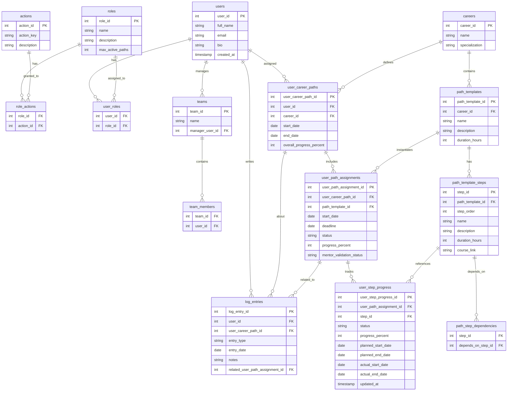
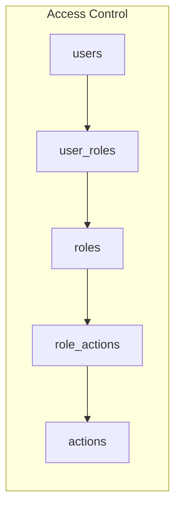
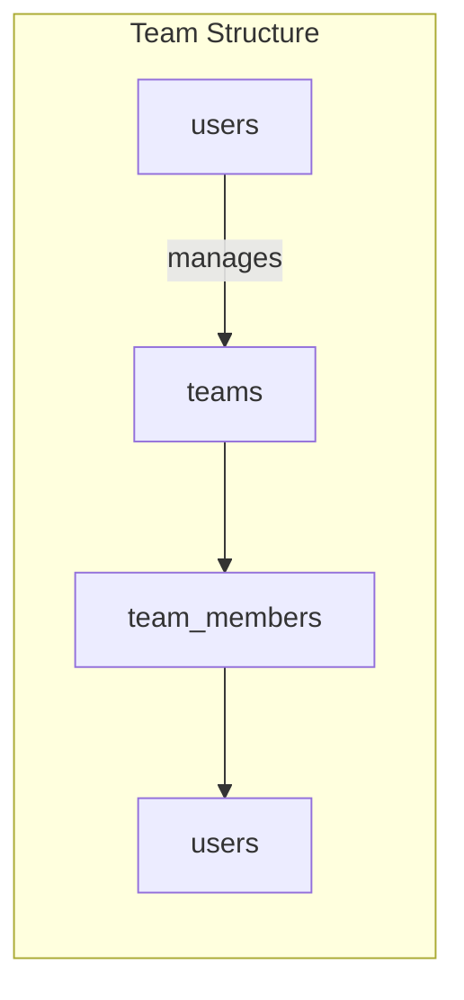
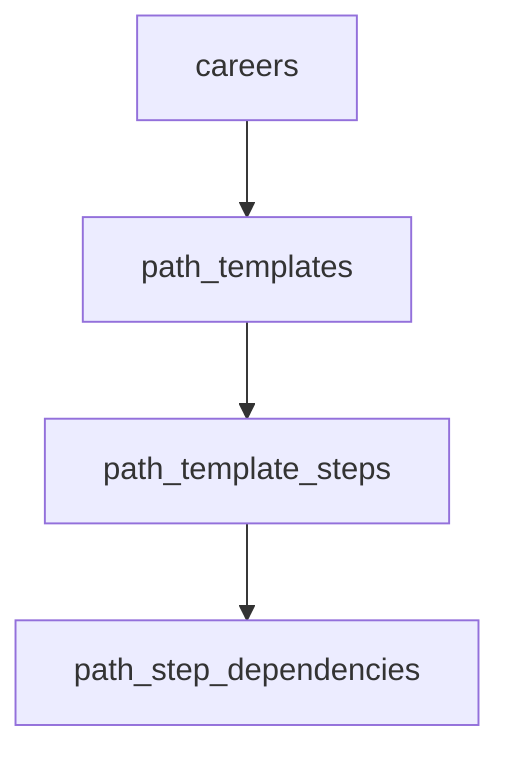
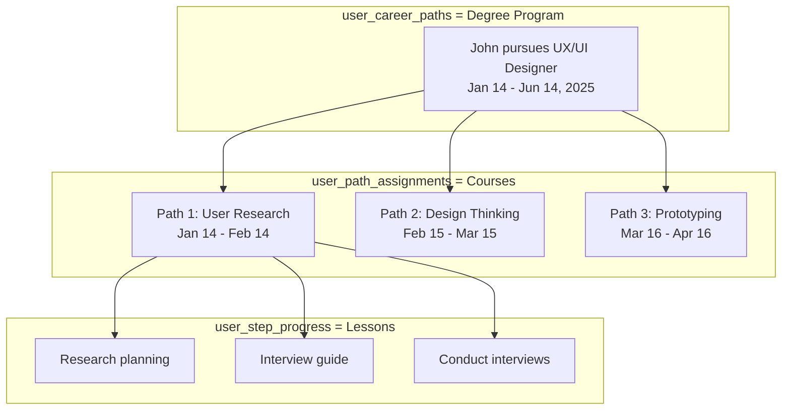
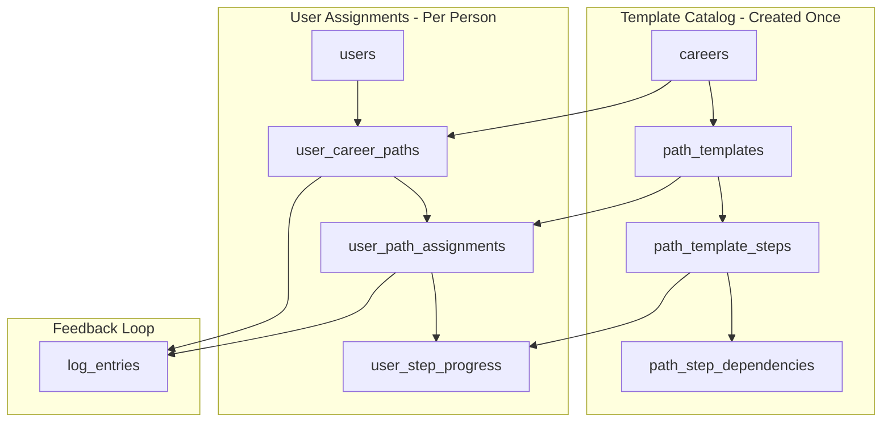

# UpSkills

A career development and upskilling platform that enables organizations to
manage learning paths, track employee progress, and facilitate mentor-mentee
relationships.

## Initial Setup

To run this project and its toolchain, [install
mise](https://mise.jdx.dev/getting-started.html), then run:

```
mise install
```

This will install:

- UV for managing the Python Backend
- Node and NPM for managing the React Frontend
- Lefthook for multi-project pre-commits and linter
- Podman to build and run container images

To initialize the projects run

```
mise init
```

This will create the virtual environment with `uv` and install the packages from
`package.json` with `npm`.

To execute the project-wide linter run

```
mise lint
```

This will run pre-commits in the backend with [prek](https://prek.j178.dev/) and
[eslint](https://eslint.org/) in the frontend.

To serve the backend and frontend run

```
mise serve
```


## Overview

UpSkills helps organizations:

- **Define Career Paths**: Create structured learning journeys with courses,
  steps, and dependencies
- **Assign & Track Progress**: Mentors assign paths to mentees and monitor
  completion
- **Validate Learning**: Mentors approve/reject completed steps and provide
  feedback via logbook entries
- **Manage Teams**: Organize users into teams with managers overseeing progress

## Roles

| Role | Responsibilities |
|------|------------------|
| **Admin** | Full system access - manage users, roles, careers, paths, and all settings |
| **Path Creator** | Create and edit career paths, define steps and dependencies, manage content |
| **Mentor** | Assign paths to mentees, validate progress, approve/reject steps, add logbook feedback |
| **Mentee** | View assigned paths, track progress, mark steps complete (pending validation) |

## Tech Stack

- **Frontend**: React 18 + TypeScript + TailwindCSS + Vite
- **Backend**: Python 3.12 + FastAPI + SQLAlchemy + Pydantic
- **Database**: SQLite (dev) / PostgreSQL (prod)
- **Package Management**: UV (backend), npm (frontend)
- **Containerization**: Docker + docker-compose

## Database Schema



### Schema Explanation

The schema is organized into **4 main domains**:

#### 1. Users & Access Control



| Table | Purpose |
|-------|---------|
| `users` | All people in the system (admins, mentors, mentees, path creators) |
| `roles` | System roles: admin, path_creator, mentor, mentee. Includes `max_active_paths` to limit concurrent assignments |
| `actions` | Atomic permissions like `team.view`, `paths.assign`, `paths.validate` |
| `role_actions` | Maps which actions each role can perform |
| `user_roles` | Assigns roles to users. A user can have multiple roles |

#### 2. Team Organization



| Table | Purpose |
|-------|---------|
| `teams` | Groups of users managed by a single manager |
| `team_members` | Links users to teams. A user can belong to multiple teams |

#### 3. Learning Path Templates (Catalog)



| Table | Purpose |
|-------|---------|
| `careers` | High-level career tracks (e.g., "Frontend Developer", "UX/UI Designer") |
| `path_templates` | Reusable learning paths belonging to a career. Seniority encoded in name |
| `path_template_steps` | Individual learning activities within a path (courses, modules) |
| `path_step_dependencies` | Prerequisites between steps - a step can only start after dependencies are completed |

#### 4. User Progress & Tracking

This is where **templates become real assignments**. Think of it like a
university degree:



| Level | Table | Analogy | Example |
|-------|-------|---------|---------|
| Career | `user_career_paths` | Degree Program | "John is pursuing UX/UI Designer from Jan-Jun 2025" |
| Path | `user_path_assignments` | Courses in the program | "Course 1: User Research Fundamentals (4 weeks)" |
| Step | `user_step_progress` | Lessons in each course | "Lesson 1: Research planning (6 hours)" |

| Table | Purpose |
|-------|---------|
| `user_career_paths` | When a user is assigned to pursue a career track with start/end dates |
| `user_path_assignments` | Concrete assignment of a path template to a user's career journey |
| `user_step_progress` | Tracks progress on each step with planned vs actual dates |
| `log_entries` | Logbook for mentor-mentee interactions, approvals, and notes |

#### Complete Data Flow



**The flow is**:
1. **Admins/Path Creators** define careers, paths, and steps
2. **Mentors** assign career paths to mentees
3. **System** creates `user_career_paths` → `user_path_assignments` →
   `user_step_progress`
4. **Mentees** work through steps, updating progress
5. **Mentors** validate completed paths and add log entries

## Project Structure

```
upskilling/
├── backend/
│   ├── src/upskills/
│   │   ├── api/routers/       # FastAPI route handlers
│   │   ├── core/              # Config, security, dependencies
│   │   ├── db/                # Database provider abstraction
│   │   ├── models/
│   │   │   ├── db/            # SQLAlchemy ORM models
│   │   │   └── domain/        # Pydantic request/response models
│   │   ├── repositories/      # Data access layer
│   │   ├── services/          # Business logic layer
│   │   ├── containers.py      # DI container
│   │   └── main.py            # FastAPI app entry point
│   ├── tests/
│   ├── pyproject.toml         # Python dependencies (UV)
│   ├── Dockerfile
│   └── .pre-commit-config.yaml
├── frontend/
│   ├── src/
│   │   ├── components/        # Reusable UI components
│   │   ├── pages/             # Page components
│   │   ├── services/          # API client
│   │   ├── contexts/          # React contexts (auth)
│   │   └── types/             # TypeScript types
│   ├── package.json
│   ├── Dockerfile
│   └── nginx.conf
├── db/
│   ├── schema.sql             # Database table definitions
│   └── seed.sql               # Demo data for development
├── docs/
│   └── db/tables.md           # Quick reference for tables
├── docker-compose.yml
├── LICENSE
└── README.md
```

## Getting Started

### Prerequisites

- Python 3.12+
- Node.js 20+
- UV package manager (for Python)
- Docker (optional, for containerized deployment)

### Backend Setup

#### Windows (PowerShell or Git Bash)

```powershell
# Install UV (if not installed)
powershell -ExecutionPolicy ByPass -c "irm https://astral.sh/uv/install.ps1 | iex"

# Navigate to backend
cd backend

# Sync dependencies (creates venv automatically)
uv sync

# Run the development server
uv run poe serve-dev
```

#### macOS / Linux

```bash
# Install UV (if not installed)
curl -LsSf https://astral.sh/uv/install.sh | sh

# Navigate to backend
cd backend

# Sync dependencies (creates venv automatically)
uv sync

# Run the development server
uv run poe serve-dev
```

The API will be available at `http://localhost:8000`. API docs at
`http://localhost:8000/docs`.

**Available tasks (via poethepoet):**

| Command | Description |
|---------|-------------|
| `uv run poe serve` | Run production server |
| `uv run poe serve-dev` | Run dev server with hot reload |
| `uv run poe test` | Run tests |
| `uv run poe format` | Run pre-commit formatters |
| `uv run poe lint` | Run ruff linter |
| `uv run poe typecheck` | Run mypy type checker |

### Frontend Setup

```bash
cd frontend

# Install dependencies
npm install

# Run the development server
npm run dev
```

The frontend will be available at `http://localhost:3000`.

### Docker Deployment

```bash
# Build and run all services
docker-compose up --build

# Frontend: http://localhost
# Backend API: http://localhost:8000
```

## API Endpoints

| Prefix | Description |
|--------|-------------|
| `/api/v1/auth` | Authentication (login, register, refresh, password reset) |
| `/api/v1/users` | User management and profiles |
| `/api/v1/teams` | Team management |
| `/api/v1/careers` | Career track CRUD |
| `/api/v1/paths` | Path templates and steps |
| `/api/v1/progress` | Career paths, assignments, step progress |
| `/api/v1/logbook` | Mentor-mentee interaction logs |

## License

MIT License - see [LICENSE](LICENSE) for details.
